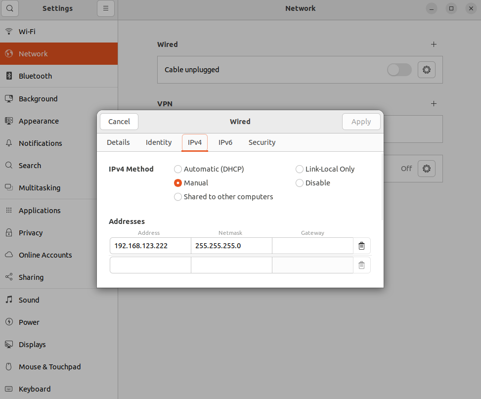

# GO2 Project Setup Guide

 ✅ Tested on **Ubuntu 22.04.5 LTS (FRESH INSTALL)**.

 Follow these steps to get the project running from scratch.

---

## Step 1: Install the Unitree GO2 SDK (Python Version)

1. Connect your PC to the robot using a **wired Ethernet cable**.

   > ⚠️ For development, this is the most reliable method.

2. Configure your **IPv4 interface** manually:

   * **IP Address:** `192.168.123.222`
   * **Subnet Mask:** `255.255.255.0` (mask 24)

   <details>
   <summary>Click to see image example</summary>

   

   </details>

   This setup is required for communication with the robot.

3. Install the SDK from the official repository:
    [Unitree SDK2 Python](https://github.com/unitreerobotics/unitree_sdk2_python)

4. Test the SDK with an Example

   Follow the instructions in the repository and run one of the provided examples to confirm that the SDK works correctly before moving forward.

   This example, `go2_sport_client.py`, is easy to run. It is located at `unitree_sdk2_python/example/go2/high_level`.

   When prompted for an **ID**, enter **3**. The robot should take one step forward.

---

## Step 2: Clone the Repository

Clone this repository (you can name the directory `GO2` for clarity):

```bash
git clone https://github.com/EitanMaimoni/GO2.git GO2
cd GO2
```

---

## Step 3: Install Project Dependencies

1. Install system packages:

   ```bash
   sudo apt update
   sudo apt install -y libgtk2.0-dev pkg-config
   ```

2. Install Python dependencies from the project root (GO2 for our example):

   ```bash
   pip install -r requirements.txt
   ```

---

## Step 4: Download YOLO Files

If the YOLO model files are missing, download them:

* **YOLOv4-Tiny Weights:** [yolov4-tiny.weights](https://github.com/AlexeyAB/darknet/releases)
* **YOLOv4-Tiny Configuration:** [yolov4-tiny.cfg](https://github.com/AlexeyAB/darknet/blob/master/cfg/yolov4-tiny.cfg)
* **COCO Names:** [coco.names](https://github.com/pjreddie/darknet/blob/master/data/coco.names)

### Place the files in the correct directory:

1. Create a `model` directory at the root of the project:

   ```bash
   mkdir model
   ```
2. Move the downloaded files into `model/`.

Your directory structure should look like this:

```
/GO2
├── /src
├── /model
│   ├── yolov4-tiny.weights
│   ├── yolov4-tiny.cfg
│   └── coco.names
```

---

## Step 5: Run the Project

Run the project with:

```bash
python3 main.py <network-interface>
```

* Replace `<network-interface>` with your Ethernet adapter name.
* Example:
   * On Ubuntu, it will often be something like `eth0`, `enp3s0`, or similar.

To find your interface name:

```bash
ifconfig
```

Look for the one assigned to `192.168.123.222` (the manual IP you set earlier) and use that in place of `<network-interface>`.

---

## Summary

1. Install and verify the **Unitree SDK**.
2. Install system + Python dependencies.
3. Clone the repo.
4. Download YOLOv4-Tiny files and place them in `/model`.
5. Run the project with:

   ```bash
   python3 main.py <your-interface>
   ```

